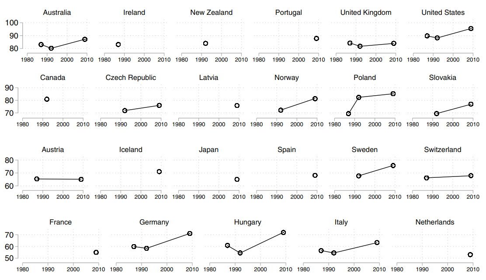
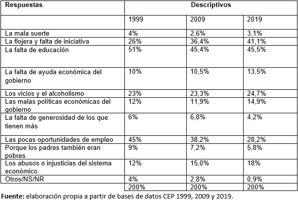
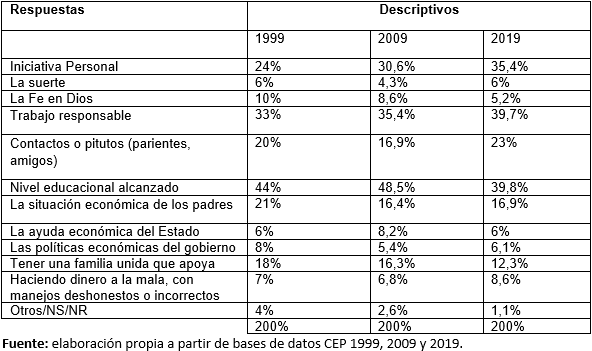

```{r setup, include=FALSE}
options(htmltools.dir.version = FALSE)
```

```{r packages-data, include=FALSE}
pacman::p_load(kableExtra,
               summarytools,
               plm, #poleed data model
               lmtest,
               texreg,
               ggplot2,
               GGally,
               tidyverse,
               dplyr,
               haven,
               gtsummary,
               nnet) 

load(file = "../Input/Data_proc/2019/proc_cep_2019.RData")
load(file = "../Input/Data_proc/2019/data_naomit2019.RData")
load(file = "../Input/Data_proc/proc_data.RData")
```

```{r xaringan-themer, include=FALSE, warning=FALSE}
library(xaringanthemer)
style_mono_light(base_color = "#23395b",
  header_font_google = google_font("Merriweather"),
  text_font_google   = google_font("Poppins", "350", "350i"),
  code_font_google   = google_font("Fira Mono")
)
```

```{css, echo = FALSE}
.regression table {
  font-size: 12px;     
}

.red { color: red; }

.tiny-text {
  font-size: 16px;
}
```   


# Contenido:

.pull-left[
- 1.- Introducción

- 2.- Antecedentes

- 3.- Estudio 1

  + 3.1.- Preguntas, objetivos e hipótesis

  + 3.2.- Datos, variables y método

  + 3.3.- Avances
]

.pull-right[
- 4.- Estudio 2

  + 4.1- Antecedentes

  + 4.2- Pregunta, objetivos e hipótesis

  + 4.3- Datos, variables y método

  + 4.4- Avances

- 5.- Discusión

- 6.- Bibliografía
]
---
class: inverse, middle, center

# 1. Introducción

---
#  Contexto y problema social

- Desigualdad socioeconómica.
    - PNUD (2017)
- **Desiguald subjetiva**
     - Creencias y explicaciones sobre desigualdades sociales, y los valores y principios que las sostienen.
     - Atiende diversos problemas. Entre ellos, el de la justificación y legitimación de las desigualdades.
     - Estudios sobre las creencias y explicaciones de la pobreza y la riqueza
  + *¿Qué explica las diferencias entre individuos en atribuciones de pobreza y riqueza?* 

--

>  "Debido a que la estratificación es un tópico central en la sociedad, las creencias y percepciones sobre estratificación están necesariamente vinculadas a las creencias sobre la sociedad en general" (Kluegel y Smith, 1981)

---

class: inverse, middle, center

# 2. Antecedentes

---

# A. Variable dependiente: atribuciones de pobreza y riqueza:

- Definición: como las personas se representan y explican que ciertos grupos sociales sufran carencias o disfruten de grandes ventajas. Clásico en la investigación de las creencias sobre la desigualdad (Kluegel y Smith 1986). 
- Atribuciones internas: se culpa al individuo
- Atribuciones externas: se explica por consecuencias estructurales
---

## Antecedentes atribuciones de pobreza y riqueza

*¿Qué explica las diferencias entre individuos en atribuciones de pobreza y riqueza?*

- Comunmente se trabaja con variables **contextuales** en estudios de comparación internacional (Bucca, 2016)
- En el nivel individual podemos separar las variables **objetivas** de las variables **subjetivas**
  + .red[Variables objetivas]: sociodemográficas y de estratificación social
      + Variable de raza, investigación EEUU (Kluegel y Smith, 1981)
      + Variable ingreso: ingresos más bajos, más atribuciones internas. (Frei et al. 2019)
      + Variable edad: a mayor edad, más atribuciones internas.(*ibid*)
      + Variable educación: más escolarización, más atribuciones internas. (*ibid*)
  + .red[Variables subjetivas]: valores y experiencia individual. (*ibid*)
      + *Se han utilizado variables similares a las de creencias meritocráticas -como SLB y PWE- pero no se ha indagado empíricamente relación de percepciones y preferencias meritocráticas con atribuciones de pobreza y riqueza*
      
--

### Pregunta de investigación: 

¿Cómo se relacionan las percepciones y las preferencias meritocráticas con las atribuciones de pobreza y riqueza?
      
---

# B. Variable independiente: creencias meritocráticas

M. Young (1962): meritocracia como un orden social que basa la distribución de los recursos a partir del mérito individual. A su vez, el mérito opera a partir de los criterios de **esfuerzo y talento**.

**Creencias meritocráticas**: las creencias de las personas acerca de cómo operan los mecanismos meritocráticos en la sociedad.
- **Percepciones meritocráticas**: cómo la gente percibe -lo que son- de meritocracia en la sociedad
- **Preferencias meritocrácticas**: cómo debiesen funcionar los mecanismos meritocráticos en la sociedad

---

## Antecedentes de la relación entre meritocracia y creencias sobre la pobreza y desigualdad social:

1. Lepianka et al. (2009): A medida que la gente respalda con más fuerza el principio de mérito como justicia, es más probable que se atribuya la pobreza a la pereza antes que a causas estructurales.

1. Madeira et al. (2019): Mayores niveles en la meritocracia descriptiva -**percepciones**- está relacionada con actitudes negativas hacia grupos marginalizados, mientras que la meritocracia prescriptiva -**preferencias**- no lo está.
  - Mayores niveles de **preferencia** meritocrática tienen un menor efecto en actitudes negativas hacia grupos muy desfavorables versus grupos medianamente desfavorables, como también que favorecen la aceptación de políticas sociales.
  
1. Castillo et al. (2019): "A mayor percepción de la meritocracia menos se percibe la desigualdad económica y, mientras más se cree -preferencias- en la meritocracia, más desigualdad se percibe." (pág. 12).

---


- Con los cambios económicos, institucionales y socioculturales en las últimas décadas, se plantea que el mérito, como valor y mecanismo generador de juicios, se instala con fuerza en la sociedad chilena (Araujo, 2017). 

- Concepto controversial y ambiguo: carácter crítico, pero también legitimador de desigualdades socioeconómicas.

- Todos creemos en alguna medida en el mérito (Cociña, 2013). Se ha insertado en diferentes esferas sociales. 

--

### Relevancia

- En el área de las ciencias sociales, surgen estudios bajo la lógica de la justicia de mercado, la cual sostiene que la posición que ocupan los individuos en la jerarquía social es producto de sus esfuerzos y méritos (Lane, 1986). -**they say**-

- Considerando que las creencias meritocráticas no se oponen a la desigualdad, sino más bien a un tipo de discriminación (Mijs y Savage, 2020), la presente investigación discute con la lógica de justicia de mercado. -**I say**- 


---
class: inverse, middle, center

# .red[Estudio 1]

---
class: inverse, middle, center

# 3.1.- Preguntas, objetivos e hipótesis

---

### Pregunta de investigación:

¿Cómo se relacionan las percepciones y las preferencias meritocráticas con las atribuciones de pobreza y riqueza? 

### Objetivos:

**Objetivo general**: 
- Analizar la relación entre las creencias meritocráticas y las atribuciones de pobreza y riqueza

**Objetivos específicos**:
1. Analizar cómo se relacionan las percepciones meritocráticas con las atribuciones de pobreza y riqueza.
1. Analizar cómo se relacionan las preferencias meritocráticas con las atribuciones de pobreza y riqueza.

### Hipótesis:

**H1.1**: A mayor percepción de meritocracia, mayores serán las atribuciones internas hacia la pobreza y la riqueza.

**H1.2**: A mayor preferencia de meritocracia, mayores serán las atribuciones externas hacia la pobreza y la riqueza.

---
class: inverse, middle, center

# 3.2.- Datos, variables y método

---

## Datos

CEP N° 83 (Mayo 2019).
+ Muestra: 1380
+ Probabilística, por conglomerados y trietápica.
+ Cuenta con **batería de preguntas de la issp 2019**

---

## Variables

### Variables dependientes:

.pull-left[| Atribuciones de pobreza                                     |
|------------------------------------------------------------------------------------------------------------------------------------|
|La mala suerte            |
|La flojera y falta de iniciativa                  |
| La falta de educación       |
| La falta de ayuda económica del gobierno       |
| Los vicios y el alcoholismo           |
| Las malas políticas económicas del gobierno |
| La falta de generosidad de los que tienen más                      |
| Las pocas oportunidades de empleo    |
| Porque los padres también eran pobres  |
| Los abusos o injusticias del sistema económico  |
]


.pull-right[| Atribuciones de riqueza                                     |
|------------------------------------------------------------------------------------------------------------------------------------|
|Iniciativa Personal |
|La suerte           |
| La Fe en Dios       |
| Trabajo responsable   |
| Contactos o pitutos (parientes, amigos)       |
|Nivel educacional alcanzado |
| La situación económica de los padres          |
| La ayuda económica del Estado  |
| Las políticas económicas del gobierno |
| Tener una familia unida que apoya |
| Haciendo dinero a la mala, con manejos deshonestos o incorrectos |
]

---

```{r echo=FALSE, message=FALSE, warning=FALSE, results='hide'}
data_atribuciones_pob1 <- proc_cep_2019 %>% dplyr::select(at_pobreza1)
data_atribuciones_pob2 <- proc_cep_2019 %>% dplyr::select(at_pobreza2)

tab_pob1<- data_naomit2019 %>% dplyr::select(pob_attclass)
```

.pull-left[
```{r echo=FALSE, message=FALSE, warning=FALSE, results='asis'}
print(dfSummary(data_atribuciones_pob1, headings=FALSE),table.classes = 'tiny-text', method = 'render')
```
]

.pull-right[
```{r echo=FALSE, message=FALSE, warning=FALSE, results='asis'}
print(dfSummary(data_atribuciones_pob2, headings=FALSE),table.classes = 'tiny-text', method = 'render')
```
]

---

```{r echo=FALSE, message=FALSE, warning=FALSE, results='hide'}
data_atribuciones_riq1 <- proc_cep_2019 %>% dplyr::select(at_riqueza1)
data_atribuciones_riq2 <- proc_cep_2019 %>% dplyr::select(at_riqueza2)

tab_attp <- data_naomit2019 %>% dplyr::select(at_riqueza2)
```

.pull-left[
```{r echo=FALSE, message=FALSE, warning=FALSE, results='asis'}
print(dfSummary(data_atribuciones_riq1, headings=FALSE),table.classes = 'tiny-text', method = 'render')
```
]

.pull-right[
```{r echo=FALSE, message=FALSE, warning=FALSE, results='asis'}
print(dfSummary(data_atribuciones_riq2, headings=FALSE),table.classes = 'tiny-text', method = 'render')
```
]

---

## Tipología de atribuciones de pobreza y riqueza


.very-tiny[
|     | |      Primera más  |   importante |
|------------|:-----------:|:------------:|------------|
| | |  Estructuralista    | Individualista  |
|**Segunda más** |  Estructuralista |  *Estructuralista*    | *Mixta*  |
|**Importante** | Individualista |  *Mixta*    | *Individualista*  |
]


.pull-left[**Frecuencia atribuciones de pobreza**
```{r results='asis', echo=FALSE}
data_naomit2019 %>%
  select(pob_attclass) %>% 
  tbl_summary()
```
]

.pull-right[**Frecuencia atribuciones de riqueza**
```{r results='asis', echo=FALSE}
data_naomit2019 %>%
  select(riq_attclass) %>% 
  tbl_summary()
```
]

---

class: title title-8
.very-tiny[
## **Variables**
]
.very-tiny[
| Variable    | Descripción|       Respuesta/valores|
|------------|:-----------:|------------|
| |**Variables dependientes**  |           |
| **A. Atribuciones de pobreza** | Elección de las dos primeras causas que explican la pobreza.  |  Externas, internas y mixtas |
| **B. Atribuciones de riqueza** | Elección de las dos primeras causas que explican la riqueza.  |  Externas, internas y mixtas |
| |**Variables independientes** |          |
| **A. Percepciones meritocrática**|          |              |
| Tener un buen nivel de educación |   Actualmente en Chile, ¿cuán importante es para surgir en la vida tener un buen nivel de educación? |Likert 1/5: No es importante / Esencial  |
| Tener ambición| Actualmente en Chile, ¿cuán importante es para surgir en la vida tener ambición?  | Likert 1/5: No es importante / Esencial |
| El trabajo duro | Actualmente en Chile, ¿cuán importante es para surgir en la vida el trabajo duro? | Likert 1/5: No es importante / Esencial |
]

---

.very-tiny[
| Variable    | Descripción|       Respuesta/valores|
|------------|:-----------:|------------|
| **B. Preferencias meritocráticas**|         |       |
|El nivel de responsabilidad que tiene su trabajo |  Al decidir cuánto debería ganar la gente, ¿cuán importante debería ser, a su juicio, el nivel de responsabilidad que tiene su trabajo? |Likert 1/5: No es importante / Esencial   |
| El número de años dedicados a educación y capacitación| Al decidir cuánto debería ganar la gente, ¿cuán importante debería ser, a su juicio, el número de años dedicados a educación y capacitación?  | Likert 1/5: No es importante / Esencial  |
| Lo bien que él o ella realiza su trabajo | Al decidir cuánto debería ganar la gente, ¿cuán importante debería ser, a su juicio, lo bien que él o ella realiza su trabajo?  |Likert 1/5: No es importante / Esencial  |
| **C. Control**|          |              |
| Sexo | Sexo del encuestado/a | Hombre (0) / Mujer (1) |
| Edad | Edad del encuestado/a | Escala continua |
| Escolarización | Nivel educacional alcanzado por el/la encuestado/a | "Primaria incompleta menos" = 1, "Primaria y secundaria baja" = 2, "Secundaria alta" = 3, "Terciaria ciclo corto" = 4, "Terciaria y Postgrado" = 5 |
]

---
.very-tiny[
| Variable    | Descripción|       Respuesta/valores|
|------------|:-----------:|------------|
| Estatus social subjetivo | En nuestra sociedad, hay grupos que tienden a ubicarse en los niveles más altos y grupos que tienden a ubicarse en los niveles más bajos. ¿Dónde se ubicaría usted? | Escala de 1 a 10 |
| *Ingresos familiares* | *Tramos de ingresos en los cuales el/la encuestado/a ubica a su hogar* | *Escala de 1 a 10* |
]

---

# Método

- Se realizará una regresión logística multinomial.

<math xmlns="http://www.w3.org/1998/Math/MathML" display="block">
  <mi>l</mi>
  <mi>n</mi>
  <mrow data-mjx-texclass="INNER">
    <mo data-mjx-texclass="OPEN">(</mo>
    <mfrac>
      <mrow>
        <mi>P</mi>
        <mo stretchy="false">(</mo>
        <mi>e</mi>
        <mi>x</mi>
        <mi>t</mi>
        <mi>e</mi>
        <mi>r</mi>
        <mi>n</mi>
        <mi>a</mi>
        <mo stretchy="false">)</mo>
      </mrow>
      <mrow>
        <mi>P</mi>
        <mo stretchy="false">(</mo>
        <mi>i</mi>
        <mi>n</mi>
        <mi>t</mi>
        <mi>e</mi>
        <mi>r</mi>
        <mi>n</mi>
        <mi>a</mi>
        <mo stretchy="false">)</mo>
      </mrow>
    </mfrac>
    <mo data-mjx-texclass="CLOSE">)</mo>
  </mrow>
  <mo>=</mo>
  <msub>
    <mi>b</mi>
    <mrow data-mjx-texclass="ORD">
      <mn>10</mn>
    </mrow>
  </msub>
  <mo>+</mo>
  <msub>
    <mi>b</mi>
    <mrow data-mjx-texclass="ORD">
      <mn>11</mn>
    </mrow>
  </msub>
  <mo stretchy="false">(</mo>
  <mi>p</mi>
  <mi>e</mi>
  <mi>r</mi>
  <mi>_</mi>
  <mi>m</mi>
  <mi>e</mi>
  <mi>r</mi>
  <mi>i</mi>
  <mi>t</mi>
  <mo stretchy="false">)</mo>
  <mo>+</mo>
  <msub>
    <mi>...</mi>
    </mrow>
  </msub>
  <mo>+</mo>
  <msub>
    <mi>b</mi>
    <mrow data-mjx-texclass="ORD">
      <mn>1x</mn>
    </mrow>
  </msub>
  <mo stretchy="false">(</mo>
  <mi>p</mi>
  <mi>r</mi>
  <mi>e</mi>
  <mi>f</mi>
  <mi>_</mi>
  <mi>m</mi>
  <mi>e</mi>
  <mi>r</mi>
  <mi>i</mi>
  <mi>t</mi>
  <mo stretchy="false">)</mo>
  <mo>+</mo>
  <msub>
    <mi>...</mi>
    </msub>
</math>


<math xmlns="http://www.w3.org/1998/Math/MathML" display="block">
  <mi>l</mi>
  <mi>n</mi>
  <mrow data-mjx-texclass="INNER">
    <mo data-mjx-texclass="OPEN">(</mo>
    <mfrac>
      <mrow>
        <mi>P</mi>
        <mo stretchy="false">(</mo>
        <mi>m</mi>
        <mi>i</mi>
        <mi>x</mi>
        <mi>t</mi>
        <mi>a</mi>
        <mo stretchy="false">)</mo>
      </mrow>
      <mrow>
        <mi>P</mi>
        <mo stretchy="false">(</mo>
        <mi>i</mi>
        <mi>n</mi>
        <mi>t</mi>
        <mi>e</mi>
        <mi>r</mi>
        <mi>n</mi>
        <mi>a</mi>
        <mo stretchy="false">)</mo>
      </mrow>
    </mfrac>
    <mo data-mjx-texclass="CLOSE">)</mo>
  </mrow>
  <mo>=</mo>
  <msub>
    <mi>b</mi>
    <mrow data-mjx-texclass="ORD">
      <mn>20</mn>
    </mrow>
  </msub>
  <mo>+</mo>
  <msub>
    <mi>b</mi>
    <mrow data-mjx-texclass="ORD">
      <mn>21</mn>
    </mrow>
  </msub>
  <mo stretchy="false">(</mo>
  <mi>p</mi>
  <mi>e</mi>
  <mi>r</mi>
  <mi>_</mi>
  <mi>m</mi>
  <mi>e</mi>
  <mi>r</mi>
  <mi>i</mi>
  <mi>t</mi>
  <mo stretchy="false">)</mo>
  <mo>+</mo>
  <msub>
    <mi>...</mi>
    </mrow>
  </msub>
  <mo>+</mo>
  <msub>
    <mi>b</mi>
    <mrow data-mjx-texclass="ORD">
      <mn>2x</mn>
    </mrow>
  </msub>
  <mo stretchy="false">(</mo>
  <mi>p</mi>
  <mi>r</mi>
  <mi>e</mi>
  <mi>f</mi>
  <mi>_</mi>
  <mi>m</mi>
  <mi>e</mi>
  <mi>r</mi>
  <mi>i</mi>
  <mi>t</mi>
  <mo stretchy="false">)</mo>
  <mo>+</mo>
  <msub>
    <mi>...</mi>
    </msub>
</math>
---

class: inverse, middle, center

# 3.3.- Avances

---
class: center, middle

# Modelos de regresión multinomial

---


```{r echo=FALSE, results='hide',warning=FALSE, message=FALSE}
data_naomit2019$pob_attclass<-factor(data_naomit2019$pob_attclass)
data_naomit2019$pob_attclass = factor(data_naomit2019$pob_attclass,
                    levels=c("externa","ambivalente","interna"))
mp0 <- multinom(pob_attclass ~ pmerit + prefmerit + sexo + ESS + nivel_educ, data=data_naomit2019)
```
```{r echo=FALSE, results='asis',warning=FALSE, message=FALSE}
htmlreg(mp0,single.row = TRUE)
```

---
class: regression


```{r echo=FALSE, results='hide',warning=FALSE, message=FALSE}
data_naomit2019$pob_attclass<-factor(data_naomit2019$pob_attclass)
data_naomit2019$pob_attclass = factor(data_naomit2019$pob_attclass,
                    levels=c("externa","ambivalente","interna"))
mp1 <- multinom(pob_attclass ~ pem_inteligencia + pem_ambicion + pem_esfuerzos + 
                 pref_responsabilidad + pref_educacion + pref_trabajo + sexo + ESS + nivel_educ, data=data_naomit2019)
```
```{r echo=FALSE, results='asis',warning=FALSE, message=FALSE}
htmlreg(mp1,single.row = TRUE)
```
---
class: inverse, middle, center

# .red[Estudio 2]

---
class: inverse, middle, center

# 4.1.- Antecedentes

---
### Transformaciones sociales en las últimas décadas


### Cambios en atribuciones de pobreza y riqueza

- Entre 1996 y 2015 existe un aumento en atribuciones internas, pero sobre todo en atribuciones mixtas o ambivalentes (Frei et al., 2020).

### Cambios en creencias meritocráticas

- No se han encontrado estudios para el caso chileno, sin embargo, existe literatura internacional la cual plantea que las percepciones meritocráticas han aumentado a nivel global (Mijs, 2019)

---


---
class: inverse, middle, center

# 4.2.- Pregunta, objetivos e hipótesis

---

## Pregunta de investigación:

**En el contexto chileno, ¿Cómo ha cambiado la relación entre las creencias meritocráticas y las atribuciones de pobreza y riqueza en los años 2000, 2009 y 2019?**

## Objetivos:

Objetivo general: Caracterizar el cambio de la relación entre las creencias meritocráticas y las atribuciones de pobreza y riqueza

Objetivos específicos:
1. Caracterizar el cambio en las percepciones y preferencias meritocrátias
1. Caracterizar el cambio de la relación entre percepciones meritocrátias y las atribuciones de pobreza y riqueza
1. Caracterizar el cambio de la relación entre preferencias meritocrátias y las atribuciones de pobreza y riqueza

---

## Hipótesis

**H2.1**: Con el paso del tiempo se observa una relación más fuerte entre percepciones meritocráticas y atribuciones de pobreza y riqueza 

**H2.2**: Con el paso del tiempo se observa una relación más fuerte entre preferencias meritocráticas y atribuciones de pobreza y riqueza

---

class: inverse, middle, center

# 4.3.- Datos, variables y método

---
## Datos

- Se utilizarán los datos correspondientes a la Encuesta Nacional de Opinión Pública Nº 39 (Marzo-Abril 2000), N° 59 (Mayo-Junio 2009) y N° 83 (Mayo 2019) llevada a cabo por el Centro de Estudios Públicos (CEP) 

## Variables

- Se utilizarán el mismo set de variables para los tres años

## Método

- Comparación de modelos (regresione multinomiales).

---

class: inverse, middle, center

# 4.4.- Avances

---
```{r echo=FALSE, results='hide',warning=FALSE, message=FALSE}
proc_data$mean_percep <- (proc_data$pem_inteligencia+proc_data$pem_esfuerzos)/2
proc_data$mean_pref <- (proc_data$pref_responsabilidad+proc_data$pref_educacion+proc_data$pref_trabajo)/3

proc_data$año<-as.factor(proc_data$año)
data_merit <- proc_data %>% dplyr::select(pem_inteligencia,pem_esfuerzos,pref_responsabilidad,pref_educacion,
                                          pref_trabajo,año)
data_merit <- na.omit(data_merit) 
```

.pull-left[**Percepciones meritocráticas**
```{r echo=FALSE, results='asis',warning=FALSE, message=FALSE}
knitr::kable(aggregate(data_merit[, 1:2], list(data_merit$año), mean), format = 'html')
```
]

.pull-left[**Preferencias meritocráticas**
```{r echo=FALSE, results='asis',warning=FALSE, message=FALSE}
knitr::kable(aggregate(data_merit[, 3:5], list(data_merit$año), mean), format = 'html')
```
]

---
class: center, middle


---
class: center, middle


---
class: inverse, middle, center

# .red[5.- Discusión]

---

## Discusión:
1. Recomendaciones para trabajar variable dependiente (LCA, K-mean cluster)
1. Dependiendo de lo anterior, métodos para analizar relación (LCR, LCR 3 pasos, regresión ordinal)
1. Variablees que no se repiten entre años
1. Variable ingresos
1. Comparación modelos entre años
1. Otros

---

# 6.- Bibliografía

- Araujo, K. (2017). Sujeto y neoliberalismo en Chile: rechazos y apegos. Nuevo Mundo Mundos Nuevos, February. https://doi.org/10.4000/nuevomundo.70649


- Barozet, E. (2017). Serie sobre la clase media chilena (2): Ese gran miedo a resbalar. Publicado: 13.04.2017. https://www.ciperchile.cl/2017/04/13/66957/

- Bucca, Mauricio. 2016. “Merit and Blame in Unequal Societies: Explaining Latin Americans’ Beliefs about Wealth and Poverty”. Research in Social Stratification and Mobility 44: 98–112. DOI: https://doi.org/ 10.1016/j.rssm.2016.02.005

- Castillo, J. C., Torres, A., Atria, J., y Maldonado, L. (2019). Meritocracy and economic inequality: Perceptions, preferences and implications. Revista Internacional de Sociologia, 77(1), 1–15. https://doi.org/10.3989/ris.2019.77.1.17.114

- Cociña, M. (2013a). ¿Cree usted que la meritocracia es buena? Publicado el  05.06.2013. https://www.ciperchile.cl/2013/06/05/%C2%BFcree-usted-que-la-meritocracia-es-buena/

- Frei, R., Castillo, J. C., Herrera, R., y Suárez, J. I. (2020). ¿Fruto del esfuerzo? Los cambios en las atribuciones sobre pobreza y riqueza en chile entre 1996 y 2015. Latin American Research Review, 55(3), 477–495. https://doi.org/10.25222/larr.464

- Kluegel, J. R., Smith, E. R. (1986). Social Institutions and Social Change. Beliefs About Inequality: Americans’ Views ofWhat Is and What Ought to be. Hawthorne, NY: Aldine de Gruyter.

---

- Lepianka, D., van Oorschot, W. y Gelissen, J. (2009). Popular explanations of poverty: A critical discussion of empirical research. Journal of Social Policy, 38, 421-438. https://doi.org/10.1017/S0047279409003092

- Mijs, J. J. B., & Savage, M. (2020). Meritocracy, Elitism and Inequality. Political Quarterly, 91(2), 397–404. https://doi.org/10.1111/1467-923X.12828

- PNUD (2017). Desiguales. Orígenes, cambios y desafíos de la brecha social en Chile. Santiago de Chile, Programa de las Naciones Unidas para el Desarrollo.

- Sainz, M., Martínez, R., Sutton, R. M., Rodríguez-Bailón, R., y Moya, M. (2020). Less human, more to blame: Animalizing poor people increases blame and decreases support for wealth redistribution. Group Processes and Intergroup Relations, 23(4), 546–559. https://doi.org/10.1177/1368430219841135

- Young, M. (1962). The Rise of the Meritocracy. Baltimore: Penguin Books.